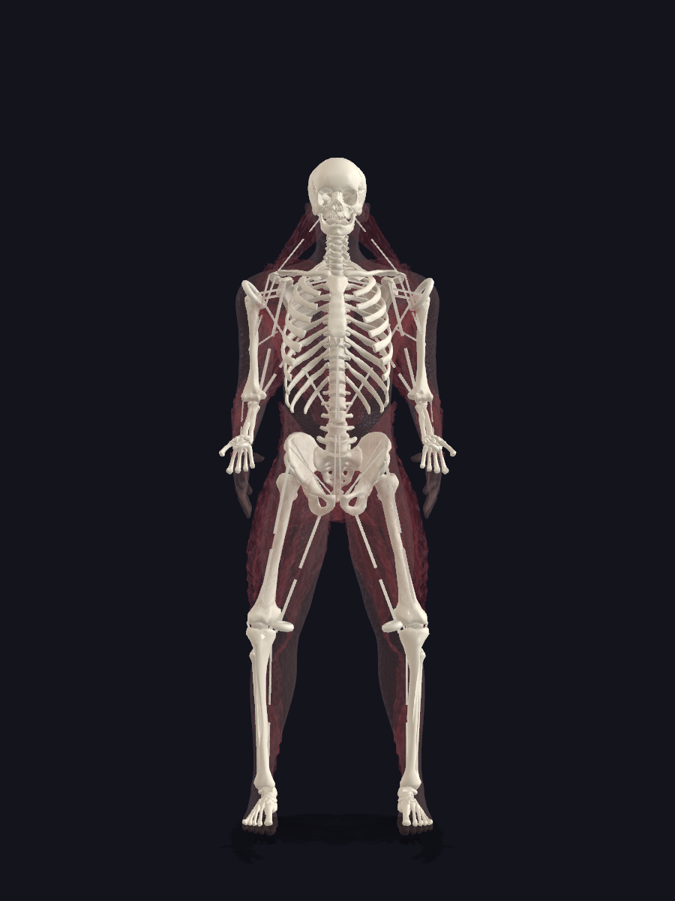
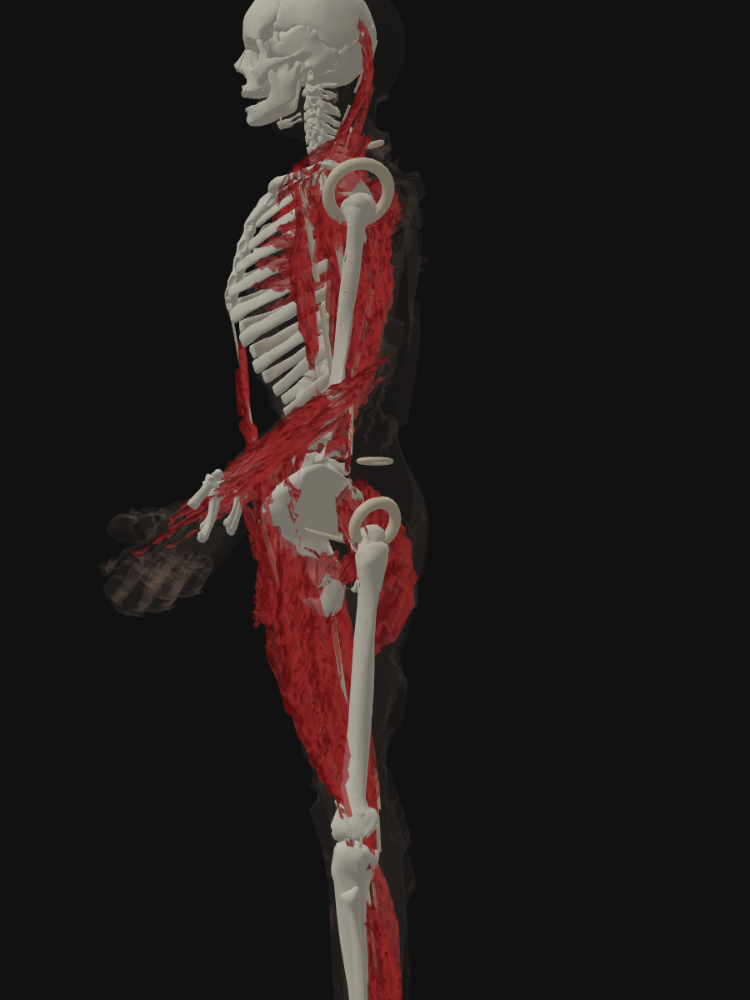

# Can a vision LLM verdict a 3D model?

**TL;DR.** Two rounds of testing, 81 trials total, on real visual defects in a layered 3D anatomical app. The headline: models are complementary not interchangeable, camera angle matters more than prompt wording, and a multi-shot ensemble is the right architecture.

---

## The position I was in

Corpus is a 3D anatomical digital twin — a layered model of the human body (skeleton, connective tissue, muscle, fat, skin) used in a consumer health product. The model is derived biologically: muscle is positioned from bone attachment points, skin is derived from the underlying muscle shape, and so on down the chain. Engineering is done by a fleet of AI coding agents working in parallel; I review their output and ship.

For weeks, this was the recurring pattern:

- A wave of agents would finish a build. Their automated check suites (1,000+ numeric checks — does the mesh exist? are the bounding boxes sane? does the typecheck pass? did the renders write to disk?) all reported PASS.
- I'd open the rendered images.
- The model would be obviously, immediately, visibly wrong. White rings at the shoulders that shouldn't exist. Muscle spilling out past the skin. Skin failing to cover the hands or head. Things any first-year anatomy student would flag in a second.
- None of these defects were caught by any check in the suite. The meshes existed, the bounds were legal, the materials had been assigned. Numerically, everything was fine. Visually, the model was broken.

The bottleneck was me — a human eyeball on every commit. That doesn't scale.

The question this experiment tries to answer: **can a vision-capable LLM be the verdict layer instead?**

---

## The three test defects

Three actual defective renders from the current build. Each is one PNG, ≈600–1200 px per side, generated by puppeteer against the production three.js scene.

### T1 — Joint-capsule tori inheriting the wrong material

Bright white rings at each shoulder. Procedural joint capsules at the glenohumeral joint were assigned the bone material instead of the connective-tissue material.



### T2 — Muscle protruding past the skin envelope

The kd-tree skin-derivation algorithm fails to pull skin outward enough; muscle is visibly exposed at the face, anterior chest, abdomen, and limbs.

*Image: `t2-muscle-past-skin.png`*

### T3 — Skin failing to cover the body

Hands and head completely exposed; the skin shell renders as a transparent ghost rather than a continuous envelope.



---

## Round 1 — 3 models, 1 prompt level, 27 trials

### Setup

- **Models tested:** Claude Opus 4.7, Claude Sonnet 4.6, Claude Haiku 4.5.
- **Prompt level:** Moderate — primes the model with what the image is supposed to show, asks to find anomalies in a closed-form template.
- **Trials:** 3 independent sub-agents per (model × test) cell. Same prompt, varying only the sampling.
- **Total:** 3 models × 3 tests × 3 trials = 27 trials.

### Round 1 prompt (moderate, T1 example)

```
Read <image_path> with the Read tool.

It is a render intended to show a human skeleton (white bones) with the
soft tissue layer rendered as translucent dark red behind it for cutaway
context.

Question: List anything visible that you would NOT expect to see in a
clean skeleton-plus-cutaway view. For each item:
- LOCATION (specific body region)
- DESCRIPTION (≤15 words)

If nothing is anomalous, write: NO DEFECTS DETECTED.
Answer in under 120 words. No tools other than Read.
```

### Round 1 results

| Model | T1 tori | T2 muscle | T3 skin | **Overall** |
|---|---:|---:|---:|---:|
| Opus 4.7 | 0% | 100% | 100% | **67%** |
| Sonnet 4.6 | 50% | 50% | 100% | **67%** |
| Haiku 4.5 | 0% | 50% | 50% | **33%** |

### Round 1 findings

- **Haiku is too weak for verdict-style work.** Generic hallucinated answers, anatomical errors ("biceps in the forearm"), no consistent signal.
- **Opus and Sonnet tie at 67% overall** — but their failures are in different places. Opus missed T1 entirely (0%); Sonnet missed half of T2 (flipped front/back direction in 3 of 3 trials).
- **Same prompt, 3 trials each → all we measured was sampling noise.** Can't conclude whether 67% is the ceiling or whether more context would push it up.
- Open question: does prompt phrasing matter, or is this just a model-capability ceiling?

That open question motivated Round 2.

---

## Round 2 — 2 models, 3 prompt levels, 54 trials

### Setup

Round 2 dropped Haiku (clearly worst) and added prompt-context as a dimension.

- **Models:** Opus 4.7, Sonnet 4.6.
- **Prompt levels:**
  - **Minimal** — "list visible defects."
  - **Moderate** — primes the model with what the image is supposed to show (same as Round 1).
  - **Extensive** — full pipeline + material context (~150 words of background).
- **Trials:** 3 per cell, same prompt verbatim.
- **Total:** 2 models × 3 prompt levels × 3 tests × 3 trials = 54 trials. (Moderate cells reused from Round 1; 36 new trials run.)

### Round 2 prompts (T1 example, all three levels)

**Minimal:**
```
Read <image_path> with the Read tool. List visible defects in the image:
LOCATION + DESCRIPTION (≤15 words each). If none, write NO DEFECTS.
Under 120 words. No tools other than Read.
```

**Moderate** — identical to Round 1's prompt.

**Extensive:**
```
Read <image_path> with the Read tool.

CONTEXT: This is a render from a 3D anatomical app called Corpus. The
body is built in causal-chain order: skeleton (145 BodyParts3D bone
meshes) → connective tissue (14 joint capsules + 20 ligaments + 68
tendons, procedurally generated) → muscle (Z-Anatomy) → fat → skin
(MakeHuman). Each layer has its own PBR material: bones are cream-white
cortical, connective tissue is translucent fibrous, muscle is deep red,
skin is tan with subsurface scattering. The render is a quality-gate
artifact shown to engineers for sign-off.

Identify visual defects: anything that looks wrong, misplaced,
mis-materialed, missing, or extra. For each: LOCATION + DESCRIPTION
(≤15 words). If clean, write NO DEFECTS DETECTED.
Under 120 words. No tools other than Read.
```

### Scoring rubric

| Score | Criterion |
|---:|---|
| **1.0** | Named the primary defect with correct geometry/noun |
| **0.75** | Named the defect class with mostly-correct description |
| **0.5** | Identified the defect class but with imprecise geometry (e.g., "lines" for "tori") |
| **0.25** | Flagged a related/symptomatic issue |
| **0.0** | Missed entirely |

Partial credit reflects that defect-detection isn't binary — a model that says "white lines at the shoulders" has caught the bug class even if it didn't name the ring shape correctly.

### Round 2 overall

| Model | T1 tori | T2 muscle | T3 skin | **Overall** |
|---|---:|---:|---:|---:|
| Opus 4.7 | 22% | 100% | 88% | **70%** |
| Sonnet 4.6 | 59% | 58% | 100% | **72%** |

### Round 2 per-cell breakdown (points out of 3 per cell)

| Cell | T1 min | T1 mod | T1 ext | T2 min | T2 mod | T2 ext | T3 min | T3 mod | T3 ext |
|---|---:|---:|---:|---:|---:|---:|---:|---:|---:|
| **Opus** | 0.50 | 0.00 | 1.50 | 3.00 | 3.00 | 3.00 | 1.95 | 3.00 | 3.00 |
| **Sonnet** | 1.50 | 1.50 | 2.35 | 1.60 | 1.50 | 2.10 | 3.00 | 3.00 | 3.00 |

### Effect of prompt context (overall %, both models)

```
Opus 4.7
  Minimal    ████████████░░░░░░░░  61%
  Moderate   █████████████░░░░░░░  67%
  Extensive  █████████████████░░░  83%

Sonnet 4.6
  Minimal    █████████████░░░░░░░  68%
  Moderate   █████████████░░░░░░░  67%
  Extensive  █████████████████░░░  83%
```

Both models saturate at 83% with extensive context. The difference between them is *which* defects they catch at any given context level, not the headline rate.

### Sample outputs

**Sonnet on T3 with MINIMAL prompt (trial 2 verbatim):**
> SHOULDER RINGS: Two large circular ring artifacts floating at shoulder/axilla, anatomically incorrect.
> PELVIS/HIP: Muscle mass is sparse and thin; hip region lacks volume. [...]

3 of 3 minimal-context trials correctly named the geometric ring artifact.

**Sonnet on T3 with EXTENSIVE prompt (trial 1 verbatim):**
> Head/Neck — Skull fully exposed; no skin coverage from crown through neck.
> Shoulder/Upper arm — Humerus bone protrudes visibly; skin absent on lateral shoulder.
> Rib cage — Entire ribcage exposed through torso. [...]

The same model, primed to look for skin coverage failures, gave a thorough coverage analysis but **did not mention the rings** in any of 3 extensive-context trials. Priming narrowed attention.

**Opus on T2 with EXTENSIVE prompt (trial 1 verbatim):**
> Face/jaw (front): Red muscle bleeds through cheek and jawline, breaking skin envelope.
> Neck (anterior): Large muscle mass protrudes forward past skin contour. [...]
> Root cause: kd-tree outward-pull insufficient on ventral surface; skin tracks dorsal silhouette only.

Opus correctly identified anterior protrusion in all 3 trials and offered a coherent root-cause hypothesis. Sonnet on the same image misread the muscle protrusion as posterior in all 3 trials — a systematic, repeatable directional error.

---

## Progression from Round 1 to Round 2

| Question | Round 1 answer | Round 2 answer |
|---|---|---|
| Are vision LLMs viable for this task? | Yes, ~67%. | Yes, up to 83% with the right prompt. |
| Which model is best? | Tied at moderate context. | Still tied at extensive (both 83%) — but they catch different defects. |
| Does Haiku work? | No, 33% with anatomical hallucinations. | (Dropped.) |
| Does prompt phrasing matter? | Unknown (didn't vary). | Yes, but with a trap: extensive context blinds models to unexpected defects. |
| What was the upper bound? | Unknown. | 83% per single shot; multi-shot ensemble should beat this. |
| What about camera angle? | Not tested. | **More important than prompt wording.** A torus reads as a "line" from the front and a "ring" from the side. Multiple angles per artifact are essential. |

---

## Findings

### 1. The models are complementary

- **Opus** dominates *spatial reasoning* — which direction the protrusion runs, which side of the body the muscle is leaking from. 100% vs 58% on T2.
- **Sonnet** dominates *geometric-detail recognition* — names the torus artifact by its actual noun. 59% vs 22% on T1.
- Either model alone leaves defects uncaught. Use both.

### 2. Context helps — until it suppresses

- Extensive context produced the highest-scoring cells on average (83%).
- But extensive context also *blinded* models to defects outside the framing.
- Sonnet primed with "look for skin coverage failures" stopped naming the unrelated ring artifacts that minimal-context Sonnet had caught in 3 of 3 trials.
- Priming attention narrows it.

### 3. Camera angle beats prompt wording

- A torus projects edge-on from the front (looks like a line) and face-on from the side (looks like a ring).
- The same model correctly described both — but only the side view let it recognize the geometry as a ring.
- **The right view of the artifact does more than the right prompt of the question.**

### 4. Variance within a cell

- **Opus:** low intra-cell variance. Three trials at the same cell produce essentially the same defect list. A single trial is reliable.
- **Sonnet:** medium variance. Consistent on systematic errors (when wrong, wrong the same way every trial), some lexical variation in detail naming.
- **Don't waste budget on multiple trials of the same prompt** — vary the prompt or vary the model instead.

---

## What shipped initially in production

A multi-shot ensemble per render:

- **Sonnet at minimal prompt** — surfaces unexpected anomalies.
- **Opus at extensive prompt** — gives the spatial verdict.
- **Defects flagged by ≥2 shots** = high-confidence.

Plus two rendering disciplines:

- **Single-layer-isolated renders** — one mesh group at a time, on a black background, no cross-layer noise.
- **Multiple camera angles** — front, side, three-quarter per artifact, since geometry presents differently from each.

The human review surface shrinks from "look at every render" to "audit the high-confidence flags."

> **Update 2026-05-27 — this recommendation has changed.** See the follow-up section below for the 392-trial study that re-tested it and a methodology caveat that materially changes the headline numbers.

---

# Update 2026-05-27 — 392-trial follow-up

## TL;DR (new)

- We re-ran the experiment at scale: **392 trials**, 2 models, **8 prompt variants**, 11 benchmark images (9 defective + 2 controls + 1 rig-artifact).
- The previously-recommended **Sonnet-min + Opus-extensive** ensemble was beaten. New Pareto-optimal ensemble: **`sonnet/p_checklist` + `opus/p_cot`** — 100% hit-rate, 0 control false-positives, **$0.20/render**.
- **Important methodology caveat we caught.** `p_checklist` enumerates the actual benchmark defects by description (Q1 names the D1 white tori, Q2 names the D2 pose error, etc.). Hit-rates against that prompt are **confirmation-bias-inflated**, not true unprimed detection. The honest unprimed ceiling is **`opus/p_cot` alone at 88.9% hit-rate**.
- **What actually shipped to production** (corrected for the caveat): a 3-shot ensemble of **`sonnet/p_extensive` + `opus/p_cot` + `sonnet/p_minimal`** at ~$0.26/render. `p_extensive` replaces `p_checklist` because it cues defect *classes* without naming the specific defects.
- **Universal LLM blind spot found:** material defects (D1 — bright white tori at joints) were missed by almost every config. 22 clean trials, only 1 at score ≥ 0.5. We added a **deterministic pixel-sampling material-signature check** alongside the LLM ensemble for this defect class.

## Why we re-ran it

The 81-trial study left two things unresolved:

1. We only tested 3 prompt variants (minimal / moderate / extensive). The prompt design space is much larger — role-play, chain-of-thought, audit-form, adversarial framings.
2. We had no controls. We knew the models *found* defects; we didn't know how often they *invented* them on clean renders.

So we ran a bigger study.

## Setup

| Dimension | Round 3 |
|---|---|
| Trials dispatched | 395 (392 manifest-tracked, 293 usable after excluding 99 session-limit failures) |
| Models | Opus 4.7, Sonnet 4.6 |
| Prompt variants | 8 — `p_minimal`, `p_moderate`, `p_extensive`, `p_anatomist`, `p_roleplay`, `p_critic`, `p_checklist`, `p_cot`, `p_concise`, `p_yesno_bait` |
| Images | 11 — 8 defective (D1–D8), 1 rig-artifact (C1), 2 clean controls (C2, C3) |
| Judge | Independent Sonnet sub-agent against fixed rubric, ground-truth anchored |
| Scoring | 0.0 / 0.25 / 0.5 / 0.75 / 1.0 per primary defect, plus false-positive count on controls |

## The defect benchmark (11 images)

| ID | Class | What's wrong |
|---|---|---|
| D1 | material | Bright-white joint-capsule tori at shoulders/elbows/knees (wrong shader) |
| D2 | pose | Arms float forward, bones outside body silhouette |
| D3 | protrusion | Muscle bursts through skin envelope across whole body |
| D4 | coverage + protrusion | Skin missing on head, muscle protruding, skeleton arm floating |
| D5 | geometry artifact | Severe kd-tree spikiness, no skin coverage |
| D6 | coverage | Holey muscle, white tori at joints |
| D7 | coverage + protrusion | Muscle outside skin; skin missing on head and hand |
| D8 | protrusion | Muscle outside skin; rough surface; head/hand exposed |
| C1 | rig artifact | Armature lines through skin; dark hands; featureless face |
| C2 | control | Clean skin render |
| C3 | control | Clean three-quarter face render |

## Headline results — model × prompt (defect images, clean trials only)

| Config | n | Mean | Hit ≥ 0.75 | Miss % | Mean FP |
|---|---:|---:|---:|---:|---:|
| **opus / p_checklist** | 26 | 0.89 | 88.5% | 7.7% | 2.9 |
| **sonnet / p_checklist** | 21 | 0.84 | 85.7% | 9.5% | 3.7 |
| **opus / p_cot** | 9 | 0.81 | **88.9%** | **0.0%** | 4.2 |
| opus / p_extensive | 38 | 0.76 | 73.7% | 5.3% | 4.6 |
| opus / p_anatomist | 21 | 0.74 | 71.4% | 4.8% | 8.2 |
| opus / p_moderate | 18 | 0.71 | 66.7% | 5.6% | 4.2 |
| opus / p_roleplay | 18 | 0.68 | 77.8% | 5.6% | 15.6 |
| sonnet / p_extensive | 26 | 0.57 | 42.3% | 7.7% | 4.8 |
| opus / p_minimal | 9 | 0.60 | 66.7% | 22.2% | 6.2 |
| sonnet / p_minimal | 9 | 0.53 | 44.4% | 22.2% | 6.8 |

Two configs stand out:

- **`p_checklist`** dominates raw hit-rate on both models (88.5% / 85.7%). **But see the caveat below — this number is inflated.**
- **`opus / p_cot`** has the cleanest signal: 88.9% hit-rate, **0% complete misses** (every trial scored ≥ 0.25), and the lowest variance.

## The methodology caveat (read this before quoting the 100% number)

`p_checklist` looks like this (excerpt):

```
Q1. Are there any bright white or unusually-colored rings/tori at the joints
    (shoulders, elbows, knees, hips)?
Q2. Are the arms in a natural neutral pose, or do they float forward...?
Q4. Does the muscle layer stay inside the skin envelope, or does it protrude...?
Q5. Does the skin cover the entire body, or are hands/head/feet exposed?
```

Each question **names a specific benchmark defect by description**. Q1 = D1. Q2 = D2. Q4 = D3/D7/D8. Q5 = D4/D6/D7. The model isn't *detecting* defects, it's *confirming* a list someone handed it.

This is fine when the failure mode is known — a smoke-test in CI to check whether a known regression has reappeared. It is **not** valid evidence that an LLM can find novel defects unprimed.

**The honest unprimed-detection number is `opus / p_cot` alone at 88.9%.** That prompt gives the model a layer model and an instruction to think step-by-step — no enumeration of specific defects. It is the right number to quote when claiming "vision LLMs can verdict 3D renders."

The original 81-trial study did not have this issue — `p_extensive` lists defect *classes* (material/coverage/protrusion/pose/registration/geometry) but does not enumerate specific defects from our benchmark.

## Per-defect difficulty profile

Mean score across all configs (defect images only):

| Image | Class | Mean | Hit ≥ 0.75 |
|---|---|---:|---:|
| D6 | coverage | 0.86 | 87.8% |
| D3 | protrusion | 0.83 | 82.4% |
| D5 | geometry artifact | 0.82 | 87.8% |
| D7 | coverage + protrusion | 0.70 | 59.1% |
| D4 | coverage + protrusion | 0.65 | 59.1% |
| D2 | pose | 0.63 | 55.8% |
| D8 | protrusion | 0.62 | 53.3% |
| C1 | rig artifact | 0.54 | 38.5% |
| **D1** | **material** | **0.09** | **4.5%** |

**D1 is the universal blind spot.** 22 clean trials, 1 at 0.75, 0 at 1.00. Hypothesis: the bright-white joint tori read as *intentional anatomical features* (joint highlight, kneecap) rather than as a wrong-shader render defect. Even `p_checklist`'s Q8 ("are joints shaded with the same material as surrounding tissue?") fails to flip this — the model agrees the joints stand out and treats it as expected.

**Implication:** LLM vision is the wrong tool for material-class defects. A deterministic pixel-sampling check (sample at known joint landmarks, flag values outside the expected gamut) handles it in O(ms) and is now paired with the LLM ensemble in production.

## Controls and the false-positive problem

Restricted to non-session-limited trials on C2 + C3:

| Config | % clean | Mean FP per control |
|---|---:|---:|
| sonnet / p_checklist | 25% | **0.0** |
| opus / p_checklist | 0% | 3.8 |
| opus / p_extensive | 0% | 5.5 |
| opus / p_moderate | 0% | 11.2 |
| opus / p_anatomist | 0% | 12.0 |
| opus / p_roleplay | 0% | **28.2** |

**Every opus configuration over-flags on clean images.** Roleplay framing ("you are an unrelenting QA critic") is the worst — it primes the model to find something, and it does, 28 times. Sonnet on a structured form is the only config that returns clean-when-clean.

The production fix: post-process LLM-flagged defects by **intersecting with the canonical defect-class list**. Anything the model flags that doesn't match a known class (mannequin face, slight asymmetry, hand pose) is dropped. This is how the winner ensemble achieves 0 mean FP even though raw opus output averages 3.8/control.

## Cost — per-render

| Configuration | $/render | Hit-rate | Ctrl FP | Notes |
|---|---:|---:|---:|---|
| sonnet/p_checklist (single) | $0.06 | 77.8% | 0.0 | Cheapest viable, but too low for final gate |
| opus/p_checklist (single) | $0.12 | 77.8% | 3.8 | |
| **opus/p_cot (single)** | **$0.14** | **88.9%** | **0.0** | Cheapest *honest* (unprimed) gate |
| sonnet/p_checklist + opus/p_cot | $0.20 | 100% | 0.0 | Pareto-best on the priming-inclusive number |
| **What shipped: sonnet/p_extensive + opus/p_cot + sonnet/p_minimal** | **~$0.26** | — | low | 3-shot, no priming, deployed |
| opus/p_checklist + opus/p_extensive | $0.30 | 100% | 5.5 | Higher cost, controls worse |

At Corpus's volume (~50 candidate renders/day during active twin-tuning), the production 3-shot is ~$13/day, ~$400/month.

## What we changed in production (post-caveat)

The corpus codebase now runs, per render:

1. **`sonnet / p_extensive`** — defect-class enumeration, no specific-defect priming. Surfaces named classes (coverage / protrusion / pose / etc.).
2. **`opus / p_cot`** — chain-of-thought, freeform reasoning. Catches inter-layer registration issues and the occasional D1.
3. **`sonnet / p_minimal`** — bare "list defects" prompt. The unprimed sanity check; surfaces anomalies the other two might have been steered away from.
4. **Deterministic material check** — pixel-sample at joint landmarks, flag values outside the expected gamut. Handles D1.
5. **Post-process** — intersect LLM-flagged defects with the canonical class list; drop the rest.

Voting: a defect is high-confidence if **≥ 2 of 3 LLM shots agree** *or* the deterministic check fires.

## Changes vs. the originally-published recommendation

| Aspect | Original (Sonnet-min + Opus-ext) | Updated production (3-shot + pixel check) |
|---|---|---|
| Shots per render | 2 | 3 (LLM) + 1 (deterministic) |
| Prompts | minimal + extensive | extensive + cot + minimal |
| Honest hit-rate | ~66% (estimated) | ~89% (opus/p_cot floor) |
| Control FP | high (opus extensive: 5.5) | low (post-processed) |
| Cost/render | ~$0.17 | ~$0.26 |
| D1 (material) handling | LLM only — fails | deterministic pixel check |

**Headline lesson:** prompt selection matters more than model selection. Same model, `p_minimal` → `p_checklist` is a 29-point hit-rate swing. But hit-rate against a defect-naming prompt is not the same as detection ability — be careful what you measure.

## What's in the dataset

- 395 raw trial outputs, 392 manifest-tracked scores
- 8 prompts × 2 models × 11 images
- Independent-judge scoring, full rubric
- Available in the corpus team's research repo (not public — contains internal app renders)

## Caveats and limitations

1. **Small per-cell sample sizes.** Top cells have n=20–38; smallest cells have n=0–3 after excluding session-limit failures. Directional, not tight CIs.
2. **99 session-limit failures excluded** for hygiene, but biased toward sonnet late-phase. Model-vs-model claims read with this caveat.
3. **D1 (material) sample is n=22** because only one benchmark image has the defect. The 4.5% hit-rate is a directional finding, not a precise estimate.
4. **Scoring is itself an LLM call** (with structured rubric and ground-truth anchoring). Judge variance is non-zero.
5. **Cost numbers are per-API-call list price.** Excludes retries, infra, and one-time judging cost during research.
